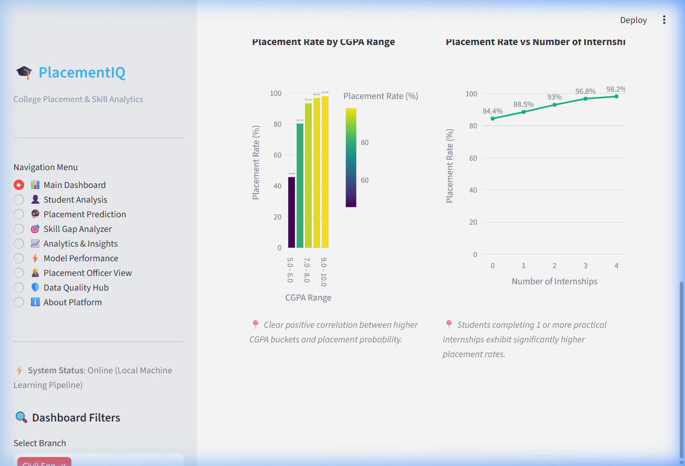
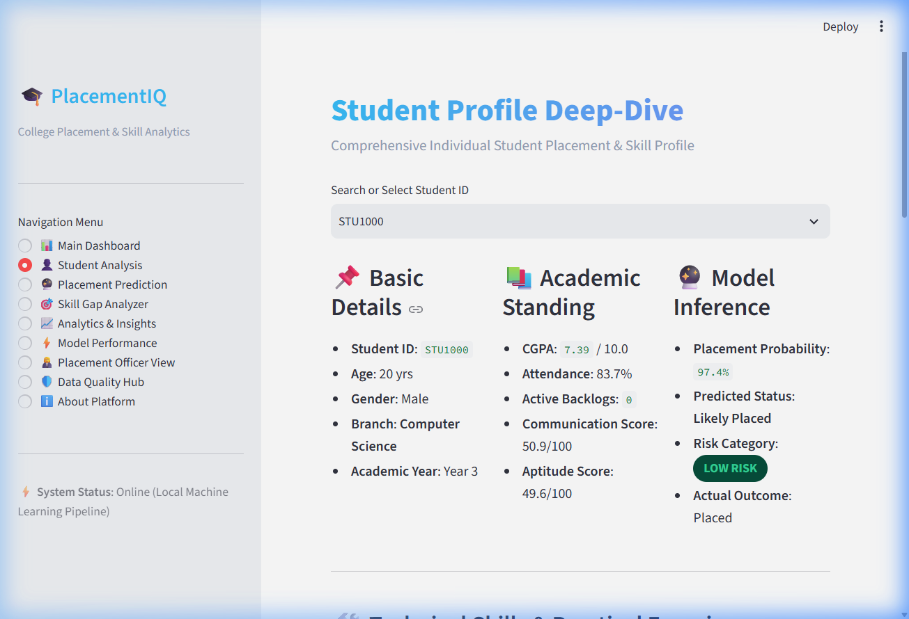
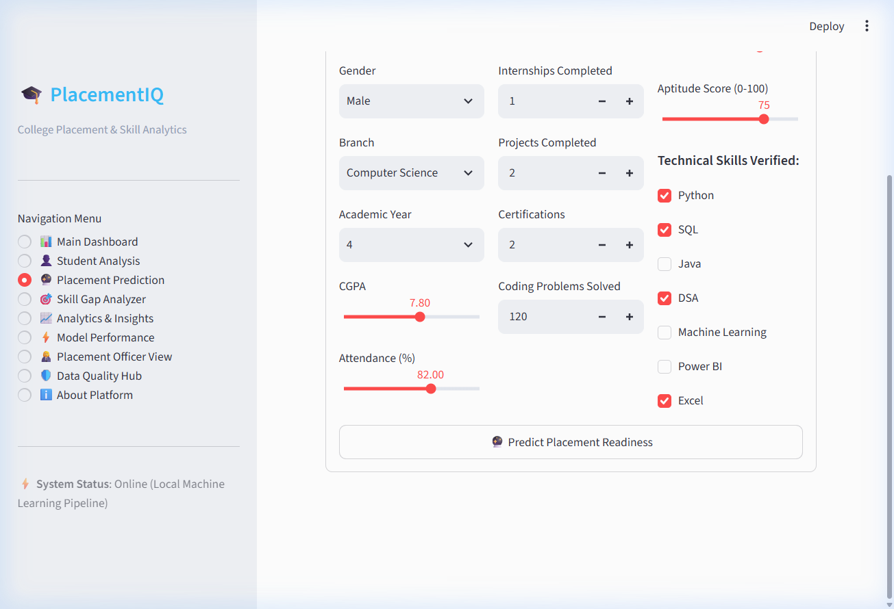
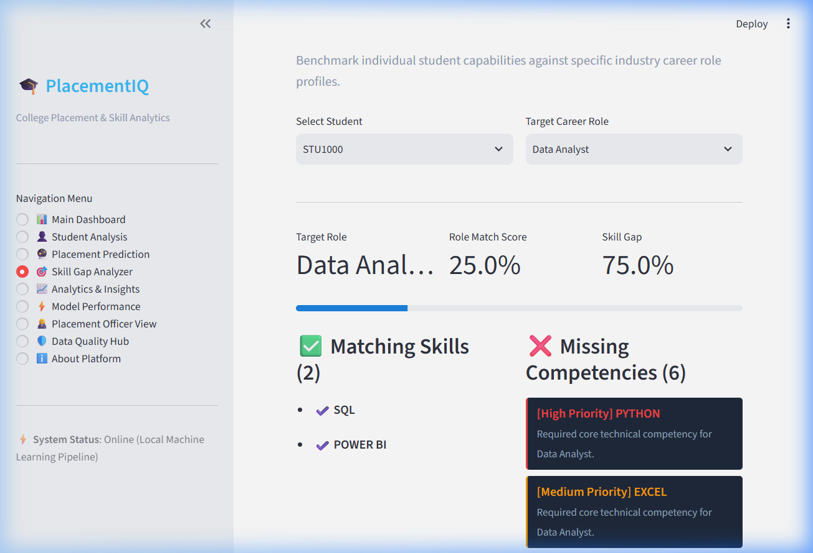
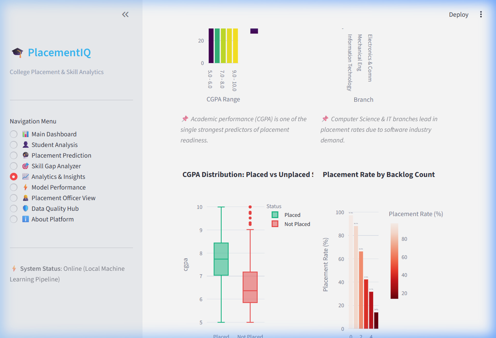
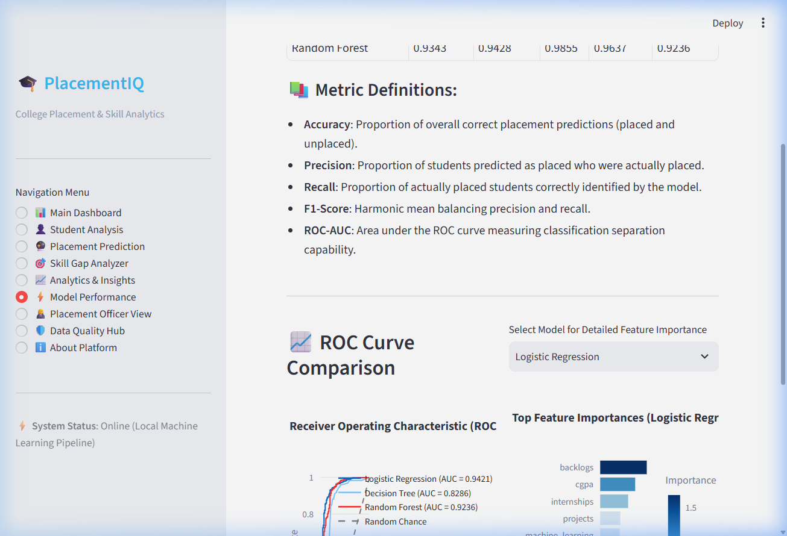

# PlacementIQ: College Placement Prediction & Skill Gap Analytics Platform

> **Production-Style Academic Data Science & Machine Learning Decision-Support System**



---

## 📌 Problem Statement & Motivation
Campus placement is a vital benchmark for academic institutions. However, placement officers and students frequently face major hurdles:
- **Lack of early risk identification**: Students at high risk of remaining unplaced are often identified late in their final year.
- **Unclear skill expectations**: Students struggle to map their academic background to specific industry roles (*Data Analyst*, *ML Engineer*, *Software Developer*).
- **Generic feedback**: Advice provided to students is rarely tailored to their specific technical, coding, or soft-skill gaps.

**PlacementIQ** addresses these challenges by delivering an end-to-end analytics platform that analyzes placement drivers, predicts individual placement readiness, identifies role-specific skill gaps, and recommends targeted improvements.

---

## 🎯 Key Features

1. **Executive Dashboard**: Dynamic KPI cards, branch performance benchmarks, interactive multi-dimensional filters, and live statistical distribution plots.
2. **Student Analysis**: Individual student profile deep-dive featuring academic history, practical coding experience, risk badges, and custom recommendations.
3. **Placement Readiness Predictor**: Interactive input form powering real-time inference via a serialized Scikit-learn Machine Learning pipeline.
4. **Skill Gap Analyzer**: Role-specific capability benchmarking across target career profiles (*Data Analyst*, *ML Engineer*, *Software Developer*).
5. **Dynamic Recommendation Engine**: Prioritized, rule-based learning paths tailored to student backlogs, coding practice, projects, and soft skill scores.
6. **SQL Analytics Engine**: Integrated SQLite database with 8+ pre-defined analytical queries for institutional insights.
7. **Model Performance Hub**: Comprehensive evaluation matrix comparing Logistic Regression, Decision Trees, and Random Forests with ROC curves, confusion matrices, and feature importances.
8. **Placement Officer Desk**: Actionable tables highlighting at-risk students, high-CGPA students with zero internships, and exportable CSV reports.
9. **Data Quality & Audit Hub**: Complete pipeline validation for missing values, numerical boundary ranges, duplicate records, and transformation logs.

---

## 🛠️ Technology Stack

- **Core / App Framework**: Python 3.13, Streamlit
- **Data Manipulation & Analytics**: Pandas, NumPy
- **Data Visualization**: Plotly Express, Plotly Graph Objects, Matplotlib, Seaborn
- **Machine Learning**: Scikit-learn (Pipelines, ColumnTransformer, Standard Scaler, OneHotEncoder)
- **Database & Storage**: SQLite3, SQL
- **Model Serialization**: Joblib

---

## 🏗️ System Architecture

```
                               ┌───────────────────────────┐
                               │   Synthetic Dataset Generator│
                               │   (src/data_generator.py)  │
                               └─────────────┬─────────────┘
                                             │
                                             ▼
                               ┌───────────────────────────┐
                               │   Data Cleaning & Audit   │
                               │   (src/data_cleaning.py)  │
                               └──────┬─────────────┬──────┘
                                      │             │
              ┌───────────────────────┘             └───────────────────────┐
              ▼                                                             ▼
┌───────────────────────────┐                                 ┌───────────────────────────┐
│     SQLite Database       │                                 │   ColumnTransformer ML    │
│  (database/placement.db)  │                                 │       Preprocessing       │
└─────────────┬─────────────┘                                 └─────────────┬─────────────┘
              │                                                             │
              ▼                                                             ▼
┌───────────────────────────┐                                 ┌───────────────────────────┐
│      SQL Analytics        │                                 │   Model Training (3 ML)   │
│   (src/sql_analysis.py)   │                                 │   (src/train_model.py)    │
└─────────────┬─────────────┘                                 └─────────────┬─────────────┘
              │                                                             │
              │                                                             ▼
              │                                               ┌───────────────────────────┐
              │                                               │   placement_model.joblib  │
              │                                               └─────────────┬─────────────┘
              │                                                             │
              └───────────────────────┬─────────────────────────────────────┘
                                      │
                                      ▼
                       ┌─────────────────────────────┐
                       │  Streamlit Multi-Page App   │
                       │          (app.py)           │
                       └─────────────────────────────┘
```

---

## 📊 Dataset Description & Disclosure

> ⚠️ **Synthetic Dataset Disclosure**:
> *Synthetic dataset created for academic demonstration. The dataset contains 3,500 student records generated with probabilistic relationships between academic scores, internships, coding practice, technical skills, and placement targets along with realistic noise.*

### Feature Schema (3,500 Records):
| Column Name | Type | Range / Values | Description |
|---|---|---|---|
| `student_id` | String | STU1000 – STU4499 | Unique student identification tag |
| `age` | Integer | 19 – 23 | Student age |
| `gender` | Categorical | Male, Female, Other | Student gender |
| `branch` | Categorical | CSE, IT, ECE, EEE, ME, CE | Academic branch |
| `year` | Integer | 3, 4 | Current academic year |
| `cgpa` | Float | 5.0 – 10.0 | Cumulative Grade Point Average |
| `attendance` | Float | 50.0 – 100.0 | Class attendance percentage |
| `backlogs` | Integer | 0 – 5 | Active backlog subject count |
| `internships` | Integer | 0 – 4 | Practical industry internships completed |
| `projects` | Integer | 0 – 6 | Practical technical projects built |
| `certifications` | Integer | 0 – 10 | Technical certifications earned |
| `coding_problems` | Integer | 0 – 300 | Coding problems solved (LeetCode/HackerRank) |
| `python` - `excel` | Binary | 0 or 1 | Individual technical skill verifications |
| `communication_score` | Float | 0.0 – 100.0 | Soft skills & interview communication score |
| `aptitude_score` | Float | 0.0 – 100.0 | Quantitative & logical reasoning score |
| `placement` | Binary | 0 or 1 | **Target Variable** (1 = Placed, 0 = Unplaced) |

---

## ⚡ Empirical Machine Learning Results

All models were evaluated on an 80/20 stratified train-test split (`random_state=42`). Metrics were calculated dynamically from actual model predictions:

| Model | Accuracy | Precision | Recall | F1-Score | ROC-AUC |
|---|---|---|---|---|---|
| **Random Forest (Best)** | **0.9343** | **0.9428** | **0.9855** | **0.9637** | **0.9236** |
| Logistic Regression | 0.9271 | 0.9479 | 0.9709 | 0.9593 | 0.9421 |
| Decision Tree | 0.9157 | 0.9473 | 0.9580 | 0.9526 | 0.8286 |

### Best Model Selection:
- **Selected Model**: `Random Forest Classifier`
- **Primary Selection Metric**: `F1-Score` (**0.9637**)
- **Key Feature Drivers**:
  1. `backlogs` (Importance: 0.2661)
  2. `cgpa` (Importance: 0.2205)
  3. `aptitude_score` (Importance: 0.0665)
  4. `coding_problems` (Importance: 0.0635)
  5. `communication_score` (Importance: 0.0628)

---

## 🎯 Skill Gap Methodology

The **Skill Gap Analyzer** evaluates student readiness against role benchmarks:
- **Data Analyst**: Requires `Python`, `SQL`, `Excel`, `Power BI`, `Communication >= 65`, `Aptitude >= 65`.
- **Machine Learning Engineer**: Requires `Python`, `SQL`, `Machine Learning`, `DSA`, `Coding Problems >= 100`.
- **Software Developer**: Requires `Python` or `Java`, `SQL`, `DSA`, `Coding Problems >= 120`, `Projects >= 2`.

$$\text{Skill Gap \%} = \left( \frac{\text{Missing Evaluation Items}}{\text{Total Role Required Items}} \right) \times 100$$

---

## 🚀 Installation & How to Run

### Prerequisites
- Python 3.10+ installed on system.

### Step 1: Clone Repository & Navigate
```bash
git clone https://github.com/user/placementiq.git
cd placementiq
```

### Step 2: Install Dependencies
```bash
pip install -r requirements.txt
```

### Step 3: Run Data & ML Pipeline (Optional)
```bash
python src/pipeline_runner.py
```

### Step 4: Launch Streamlit Web Application
```bash
python -m streamlit run app.py
```
Open your browser at `http://localhost:8501`.

---

## 🖼️ Application Screenshots

| Main Executive Dashboard | Student Profile Deep-Dive |
|---|---|
|  |  |

| Placement Predictor | Skill Gap Analyzer |
|---|---|
|  |  |

| Exploratory Analytics (EDA) | Model Performance Matrix |
|---|---|
|  |  |

---

## 🔒 Academic & Ethical Governance

> ⚖️ **Academic Decision-Support Disclaimer**:
> *This application is an academic decision-support prototype intended to assist students and campus placement officers. It should not be used as the sole basis for real student placement or employment decisions. ML model predictions depend strictly on dataset quality and representativeness.*
